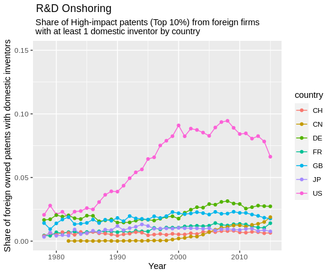
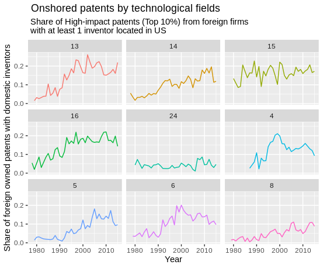
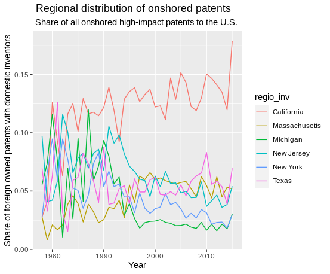

```{r setup, include=FALSE}
knitr::opts_chunk$set(echo = TRUE)
library("tidyverse")
library("tensorflow")
library("keras")
library("reticulate")

if(file.exists("/scicore/home/weder/nigmat01/inventor_migration")) {
        PATH <- "/scicore/home/weder/nigmat01/inventor_migration"}else{
                PATH <- "C:/Users/Matthias/Documents/GithubRepos/inventor_migration"}

```


```{r, echo=FALSE, include=FALSE, warning=FALSE}

#### load data -----------------------------------------------------
inv_dat <- readRDS(paste0(PATH, "/Data/patent_data/inventor_origin.rds"))

#### load the classification model  -------------------------------------------
origin_model <- load_model_hdf5(paste0(PATH, "/Data/classification_model/origin_class_model.h5"))
origin_model <- load_model_hdf5(paste0(PATH, "/Data/classification_model/origin_class_model.h5"))
origin_model <- load_model_hdf5(paste0(PATH, "/Data/classification_model/origin_class_model.h5"))

#### load functions -----------------------------------------------------

## function to encode names
source(paste0(PATH, "/Code/model_training/names_encoding_function.R"))

## function to calculate ethnic origin shares by country 
inv_comp_ctry <- function(df, country){
        
        annual_total <- filter(df, Ctry_code == country) %>%
                group_by(p_year) %>% summarise(total = n())
        
        tmp <- filter(df, Ctry_code == country) %>%
                group_by(p_year) %>% select(contains("prob")) %>%
                summarise_all(.funs = sum)
        
        tmp <- merge(tmp, annual_total, by = "p_year")
        tmp[, c(-1, -17)] <- tmp[, c(-1, -17)] / tmp$total

        tmp <- gather(tmp, key = "origin", value = "share", -p_year, -total)
        tmp$origin <- gsub("prob_", "", tmp$origin)
        tmp$country <- country

        return(tmp)
}

## function to plot the share of the dominant domestic ethnic background in different countries 
dom_country_comparison <- function(countries, domestic_origin){
        
        inv_origin_shares <- lapply(countries, function(x) inv_comp_ctry(inv_dat, x))
        names(inv_origin_shares) <- countries
        
        country_diff <- data.frame()
        
        for(i in 1:length(inv_origin_shares)){
                tmp <- filter(inv_origin_shares[[i]], origin == domestic_origin[i])
                tmp <- tmp %>% mutate(foreign_share = share) %>%
                        select(p_year, foreign_share, country) %>%
                        filter(p_year <= 2015)
                country_diff <- rbind(country_diff, tmp)
        }
        
        p <- ggplot(country_diff, aes(x = p_year, y = foreign_share, color = country))+
                geom_line()+ scale_color_hue("Country")+
                labs(y = "Share of dominant domestic origin", x = "Year",
                title = paste0(" Share of the dominant domestic ethnic background \n among patent inventors"))+
                ylim(0.3, 1)
        return(p)
}

## function to plot the share of selected ethnic backgrounds in different countries 
foreign_shares_fun <- function(COUNTRIES, ORIGIN){
        
        inv_origin_shares <- lapply(COUNTRIES, function(x) inv_comp_ctry(inv_dat, x))
        for (i in length(inv_origin_shares)) {
                inv_origin_shares[[i]]$country <- COUNTRIES[i]
        }
        inv_origin_shares <- bind_rows(inv_origin_shares)

        
        p <- ggplot(filter(inv_origin_shares, 
                           origin %in% ORIGIN & p_year <= 2015),
                    aes(x = p_year, y = share, color = origin))+
                facet_wrap(.~ country)+
                scale_color_hue("Ethnic origin")+
                labs(x = "year", y = "share of ethnic background",
                     title = paste0(" Share of selected ethnic backgrounds in different countries"))+
                geom_line()+
                ylim(0, 0.12)
        
        return(p)
}

## function to calculate the share of ethnic backgrounds in different technological fields in a given country
inv_comp_techfield <- function(df, country){
        
        annual_total <- filter(df, Ctry_code == country) %>%
                group_by(tech_field, p_year) %>% summarise(total = n())
        
        tmp <- filter(df, Ctry_code == country) %>%
                group_by(tech_field, p_year) %>% select(contains("prob")) %>%
                summarise_all(.funs = sum)
        
        tmp <- merge(tmp, annual_total, by = c("tech_field", "p_year"))
        tmp[, c(-1, -2, -18)] <- tmp[, c(-1, -2, -18)] / tmp$total
        
        tmp <- gather(tmp, key = "origin", value = "share", -p_year, -total, -tech_field)
        tmp$origin <- gsub("prob_", "", tmp$origin)
        tmp$country <- country
        
        return(tmp)
}

## function to plot the share of ethnic backgrounds in different technological fields in a given country
tech_field_plot <- function(COUNTRY, DOMESTIC_ORIGIN, 
                            TECHFIELDS, MIN_INVENTORS = 30){
        
        plot_dat <- inv_comp_techfield(df = inv_dat, country = COUNTRY) %>% 
                mutate(tech_field = as.character(tech_field))
        
        plot_dat <- filter(plot_dat, origin == DOMESTIC_ORIGIN & p_year <= 2015 &
                           tech_field %in% TECHFIELDS & total >= MIN_INVENTORS)
        
        p <- ggplot(plot_dat, aes(x = p_year, y = share))+
                facet_wrap(.~ tech_field)+
                geom_line(aes(color = tech_field))+scale_color_hue(guide = "none")+
                labs(y = "Share of domestic origin", 
                     x = "Year", title = paste0(" Share of ", DOMESTIC_ORIGIN, " origin in ",
                                                COUNTRY, " (by technological field)"))
        return(p)
}
```

## **Introduction and the General Idea**
There is a growing literature of theoretical and empirical papers (mostly concerning the USA) that focus on the effects of high-skilled migration on innovation. Typically, these studies find substantial benefits from high-skilled migration into the USA [e.g. @AcemogluAkcigit2018; @AkcigitStantcheva2016; @Moser2014; or @DoranIsen2014]. In particular, large inflows of high-skilled workers from China and India since the 1990s seemed to have fostered U.S.-based innovation [for an overview see @Kerr2016; @Peri2016; @Kerr2013]. 

I build on these empirical observations and ***investigate a potential relationship between immigration and onshoring of high-impact R&D***.

The rationale for this is motivated by insights from the trade-in-tasks literature - notably from @BaldwinRobertNicoud2014, @OttavianoPeri2013 and @GrossmanRossiHansberg2008 among others. According to this literature, onshoring of R&D can be interpreted as a form of trade-in-tasks. Furthermore, what this literature suggests is that the Rybczynski theorem from goods-trade also holds in a trade-in-tasks framework [@BaldwinRobertNicoud2014]. That is to say, inflows of foreign inventors should allow the receiving country to specialize in activities that employ these inventors intensively. In other words, given an inflow of 'foreign talent', the U.S. should become relatively more attractive for high-impact R&D activities.

There are several case studies and anecdotal evidence that support this hypothesis (e.g. European tech firms relocate some of their R&D to the U.S.). However, I could not find any large-scale empirical analysis that addresses this question in detail. The reason for this might be, because it is difficult to identify migrants among patent inventors and it is challenging to identify high-impact innovations.

**This is where I plan to make a contribution with my paper**. Specifically, I

1. design and train deep learning algorithms that classify inventors' ethnic background based on their names. 
2. use big data on patents to identify high-impact innovations and onshored R&D. 
3. can then combine these aspects to make descriptive and/or analytic investigations about the interplay between (long-term) migration and onshoring of high-impact R&D.

In what follows, I discuss and describe my approach in more detail and I present some results from exploratory data analysis. 

## **Migration and the Ethnic Composition of Patent Inventors**
Oftentimes, previous studies have focused on non-US citizens among patent inventors [@Kerr2013]. While such an approach makes a lot of sense for some specific questions (e.g. the effect of migration restrictions on innovation), it also has several shortcomings: First, the nationality of patent inventors is only observed for a sub-sample of U.S. patents and not for any other patents e.g. European patents [@MiguelezFink2013]. Second, immigrants can obtain citizenship and thus, the the share of immigrant inventors gets underestimated in the longer run [@BreschiLissoni2019]. Using the names of inventors as a proxy for ethnic background offers a remedy for these two problems. However, it introduces a new bias, which is that e.g. 2nd generation immigrants will also be considered as immigrants even though they have potentially been born in and obtained the citizenship of the immigrant country.

Therefore, by using names I obtain a measure for *ethnic background* and not directly for migrant status. This is fine for the purpose of my analysis, which is to focus on longer-run migration effects. In this regard, the previous literature has mainly used simple name-matching for some selected origins [e.g. @Kerr2013] or relied on (somewhat non-transparent) commercial tools to infer ethnic backgrounds from names [@BreschiLissoni2019]. 

### **Inferring the Ethnic Origin of Inventors with Deep Learning**
For my analysis, I desgin and train a special kind of neural network which is capable to process names. To do this, I have to encode names as sequences of data. In other words, I transform a name to a sparse matrix of zeros and ones. Rows indicate the first, second... last character of a specific name and the columns specify letters of the Latin alphabet. If the first row features a "1" in the first column and zeros in all others, this means that the first character of this name is an "A". An example for a fully encoded name is given below:

```{r}
exp_name = encode_chars(names = "rolf weder", 
                        char_dict = c(letters, " ", "END"), 
                        seq_max = 10, n_chars = 28)
exp_name[1, ,]
```

I apply this procedure to over 50'000 names, for which I have also obtained the probability of belonging to one of 15 different ethnic groups from the <a href=https://name-prism.com/about>name-prism</a> database [see @Ye2017]. With this dataset, I can train machine learning and deep learning models that learn to assign ethnic backgrounds to names. 

To start, I have trained a so-called long-short-term-memory (LSTM) model. This is an artificial recurrent neural network that is specifically designed to process sequences of data. In the case of names, this sequence corresponds to the characters of the name (as shown above). The models that I have trained thus far reach a performance that is comparable or better than some of the models that I have found in the literature (e.g. an overall accuracy of 81.9% and a average F1 score of 80.7%) [e.g. @Ye2017]. The architecture of this first model is shown below.

```{r, echo=FALSE, warnings=FALSE, message=FALSE}
origin_model
```

After training the model, I can then use it to make predictions about the ethnic background of patent inventors. Below, you can see what the output of this deep learning model is. For every name, it predicts the probability of belonging to each of the 14 different ethnic origin groups.

```{r, echo=FALSE, warnings=FALSE, message=FALSE}
NAMES <- c("rolf weder", "aya kachi")
exp_name <- encode_chars(NAMES,
                         char_dict = c(letters, " ", "END"), 
                         seq_max = 30, n_chars = 28)
exp_name <- origin_model %>% predict_proba(exp_name[ , , ]) %>% 
        round(digits = 2) %>% as.data.frame()
rownames(exp_name) <- NAMES
names(exp_name) <- names(inv_dat)[grepl("prob", names(inv_dat))]
names(exp_name) <- gsub(pattern = "prob_", "", names(exp_name))
exp_name
```

There are two possibilities to use this information for my analysis. I could either classify every name to only one ethnic background (e.g. to the one with the highest probability or according to some threshold-probability) or I could also directly use the individual class probabilities.

I decided to use the latter approach. The reason is that some names can have rather high probabilities for several ethnic groups. Two examples are given below. "Michael Muller" could be an American but also a German name. Similarly, "Stefanie Berger" could be of French or German origin. Classifying to the highest probability would not account for that.

```{r, echo=FALSE, warnings=FALSE, message=FALSE}
NAMES <- c("michael muller", "stefanie berger")
exp_name <- encode_chars(NAMES,
                         char_dict = c(letters, " ", "END"), 
                         seq_max = 30, n_chars = 28)
exp_name <- origin_model %>% predict_proba(exp_name[ , , ]) %>% 
        round(digits = 2) %>% as.data.frame()
rownames(exp_name) <- NAMES
names(exp_name) <- names(inv_dat)[grepl("prob", names(inv_dat))]
names(exp_name) <- gsub(pattern = "prob_", "", names(exp_name))
exp_name
```

Therefore, I decided to use the ethnic origin probabilities for my analysis. I proceed in the following way: For a given year and country (or region, or technological field), I sum up the probabilities to belong to ethnic class $j$ for all inventors and divide it by the total number of inventors $N$ in this country and year. All the $J$ different ethnic origin shares sum up to unity.

$$EthnicShare_j = \frac{\sum_{i = 1}^{N} P_{i,j}}{N}$$

With this approach, I obtain a measure for the ethnic composition of inventors in a given country, region or technological field for a given point in time. Below, I highlight this for the case with the four previously presented example names: A patent universe that would only consist of these four inventor names would have the following ethnic origin composition:

```{r, echo=FALSE, warnings=FALSE, message=FALSE}
NAMES <- c("rolf weder", "aya kachi", "michael muller", "stefanie berger")
exp_name <- encode_chars(NAMES,
                         char_dict = c(letters, " ", "END"), 
                         seq_max = 30, n_chars = 28)
exp_name <- origin_model %>% predict_proba(exp_name[ , , ]) %>% 
        round(digits = 2) %>% as.data.frame()
names(exp_name) <- names(inv_dat)[grepl("prob", names(inv_dat))]
names(exp_name) <- gsub(pattern = "prob_", "", names(exp_name))
colSums(exp_name) / length(NAMES)
```

In the next section, I present preliminary results when I apply the outlined procedure to a representative sub-sample of 500'000 patents inventors (the full sample will consider more than 4 million inventors).

### **Preliminary Results**
First, I want to show some results concerning the dominant domestic origin share of patent inventors located in different countries. The graph below highlights this for the US (AngloSaxon), China (Chinese), Japan (Japanese), Korea (Korean), Great Britain (AngloSaxon), France (French), Germany (German) and Italy (Italian). Switzerland is not included because it is a multilingual country. The sample data is from 1990 to 2015 (the full dataset will cover years starting in 1978).

```{r, echo=FALSE, warnings=FALSE, message=FALSE, fig.width=10, fig.height=4, fig.align="center"}
COUNTRIES <- c("US", "CN", "JP", "KR", "GB", "FR", "DE", "IT")
DOMESTIC_ORIGIN <- c("AngloSaxon", "China", "Japan", "Korea", 
                     "AngloSaxon", "French", "German", "Italian")
dom_country_comparison(countries = COUNTRIES,
                           domestic_origin = DOMESTIC_ORIGIN)
```
In the U.S. the share of Anglo-Saxon origin has steadily declines. Similarly, this is also the case for Germany and Great Britain (to a lesser extent also for France). Still, it is remarkable that the level of this domestic origin share is - and remains - much lower in the U.S. compared to other industrialized economies. Notably, in 2015 Anglo-Saxon origin corresponds to less than 50% of the ethnic composition in the U.S. (compared to around 65% for German origin in Germany). Therefore, the U.S. seemed to have retained it's privileged position in terms of inventor diversity over the last 25 years.

However, the decline of the dominant ethnic origin among patent inventors can suggest several things: First, these countries could have become more attractive for foreign talents, making their ethnic composition more diverse. Second, their education systems could have been very effective in integrating descendants of earlier immigrants to become inventors (e.g. Children of Turkish immigrants in Germany or children of Latin American immigrants in the U.S.). Third, it could also simply mean that the pattern of name-giving has changed, e.g. Germans could have become more likely to give their children no typical German names anymore (e.g. more 'Lauras' instead of 'Gudruns'). The last point should be considered by the classification model to some extent, as this would have been taken into account when I trained it. However, it cannot be completely ruled out. As a robustness test, I plot the same graph again, but this time, I classify inventors to the highest ethnic probability instead of summing up all probabilities. The graph looks very similar and I thus consider the shown trends as robust.

```{r, echo=FALSE, warnings=FALSE, message=FALSE, fig.width=10, fig.height=4, fig.align="center"}
COUNTRIES <- c("US", "CN", "JP", "KR", "GB", "FR", "DE", "IT")
DOMESTIC_ORIGIN <- c("AngloSaxon", "China", "Japan", "Korea", 
                     "AngloSaxon", "French", "German", "Italian")

class_dom_country <- function(country, domestic_origin){
        N_invs <- inv_dat %>% filter(Ctry_code == country) %>% 
                group_by(p_year) %>% summarise(N_invs = n())
        dom_origin <- inv_dat %>% filter(Ctry_code == country, 
                                         origin == domestic_origin) %>% 
                group_by(p_year) %>% summarise(N_dom_ethnic = n())
        tmp <- merge(N_invs, dom_origin, by = "p_year")
        tmp$share <- tmp$N_dom_ethnic / tmp$N_invs
        tmp$Country <- country
        tmp <- tmp %>% filter(p_year <= 2015)
}

plot_dat <- list()
for(i in 1:length(COUNTRIES)){
        plot_dat[[i]] <- class_dom_country(country = COUNTRIES[i],
                                           domestic_origin = DOMESTIC_ORIGIN[i])
}
plot_dat <- bind_rows(plot_dat)
ggplot(plot_dat, aes(x = p_year, y = share, color = Country))+
                geom_line()+
                labs(y = "Share of dominant domestic origin", x = "Year",
                title = paste0(" Share of the dominant domestic ethnic background \n among patent inventors (classification approach)"))+
                ylim(0.3, 1)
```

Another interesting thing is thus, which ethnic origins have changed over time in different countries. From the literature, it is known that the U.S. has especially attracted high-skilled immigrants from China and India. I should also observe this as an increase in these origin shares for the U.S. I investigate this in the plot below and extend the analysis to European countries as well as to origin shares of "Russia&EastEurope" and "SouthEastAsia" (i.e. Thailand, Vietnam, Malaysia, Indonesia).

```{r, echo=FALSE, warnings=FALSE, message=FALSE, fig.width=10, fig.height=4, fig.align="center"}
COUNTRIES <- c("US", "GB", "FR", "DE", "IT", "CH")
ORIGIN <- c("China", "India", "Russian&EastEurope", "SouthEastAsia")
foreign_shares_fun(COUNTRIES, ORIGIN)
```
This presents some interesting results. I do also observe a strong increase for Chinese and Indian origin shares in the U.S. (to a lesser extent also in Great Britain), but not for European countries. That is to say, inventors from these regions seem to have almost exclusively migrated to Anglo-Saxon countries. Thus, primarily the U.S. seems to be very attractive for foreign non-Western inventors. 

In the next step, I want to stress in which technological fields this inflow of foreign inventors occured. For this purpose, I plot the share of Anglo-Saxon origin among patent inventors in selected technological fields for the U.S.

```{r, echo=FALSE, warnings=FALSE, message=FALSE, fig.width=10, fig.height=4, fig.align="center"}
TECHFIELDS <- as.character(c(4, 5, 6, 8, 13:16, 22, 24))
tech_field_plot(COUNTRY = "US", DOMESTIC_ORIGIN = "AngloSaxon",
                TECHFIELDS = TECHFIELDS)
```
The technological fields that are considered here are the following: 13. Medical technology, 14. Organic fine chemistry, 15. Biotechnology, 16. Pharmaceuticals, 24. Environmental technology, 4. Digital communication, 5. Basic communication processes, 6. Computer technology, 8. Semiconductors. 

The strongest decline of Anglo-Saxon origin shares seems to be in the "new" fields related to Digitization and Semiconductors. In all of these fields, the Anglo-Saxon origin share is much below 50%, sometimes only 30%. I have also conducted the same analysis for Germany or Great Britain and also found a decline of the domestic origin share. Note, however, that due to the relatively "small" sample, these preliminary results for Germany and Great Britain are not really robust. In any case, the level of the domestic origin share is much higher and I expect this to hold for the full sample. This suggests that it might be much easier for the U.S. to attract (much more) foreign talent in key technological fields.

This brings me to the second piece of my analysis: If it is easier for the U.S. to attract high-skilled talents globally, could this push non-U.S. firms to offshore parts of their R&D to the U.S.? How I approach this question empirically is discussed in more detail in the following section.

## **Onshoring of High-Impact R&D**
The literature suggests that especially high-impact and frontier R&D is dependent to have access to global talent pools [e.g. @Kerr2013]. At the same time, a relatively large share of patents does not protect ground-breaking inventions, but rather represents follow-up innovations [@BessenMaskin2009]. Therefore, one can expect that attracting global talents especially matters for high-value/high-impact patents. These can be identified using patent citations [@Hall2005]. Patents receive citations by subsequent patent applications. And the more citations a patent receives, the more valuable it tends to be. I exploit this insight from the literature and define high-impact patents as follows: A patent is a high-impact patent if it is among the top-10% of patents with regard to received citations over the next 5 years after its priority date for a given technological field (top-1% as a robustness check). For example, for pharmaceutical patent that was filed in 1995 I consider the following: How many citations did the patent receive up to the year 2000 and, regarding this metric, is it among the top-10% of all pharmaceutical patents filed in 1995? If it is, it is considered a high-impact patent.

After identifying such high-impact patents, I then combine this with information on the company that owned the patent when it was filed and on the inventors who were involved developing it. With this, I can infer patents that whose development was at least partially offshored to the U.S. by non-U.S. companies. I do this the following way: First I only consider patents that are owned by companies that are not located in the U.S. Second, I then consider the total number of patents that these companies have filed per year. Third, I calculate the share of these patents, where at least one inventor had a resident address in the U.S.. As a robustness check I also did it for at least two and at least three inventors. Thus, I obtain the share of patents by non-U.S. firms that was partially offshored to the U.S. Of course, I can not only do this for the U.S. but also for other countries. The plot below shows the evolution of this share for different countries over time:

<center>
{height=66%}
</center>

There is a large gap between the U.S. and all other countries, which has strongly increased from 1990 to 2000. The data clearly shows that the U.S. is extremely attractive for foreign offshoring of R&D. Again, it is also very interesting to investigate, which technological fields have benefited the most from onshoring. This is plotted in the next graph for the same technological fields as before. Onshoring seems to have strongly increased to almost all of them.

<center>
{height=66%}
</center>

However, this could even be underestimated. For example, if Roche has a subsidiary in the U.S. that files patents independently from the parent company in Switzerland, this would not show up as onshoring in the data. There are possibilities to correct for this bias to some extent via string-matching of firm names and I will consider to address this during the research project. However, I do not expect the results to change. Rather, the trend will probably even be amplified.

A last observation that I have made is that onshoring is very concentrated within the U.S., which is a known tendency from the economics of geography literature. Below, I plot the regional distribution of onshored patents in the U.S., that is the shares of some regions on all onshored patents.

<center>
{height=66%}
</center>

This data is not smoothed and is thus quite messy at the moment. However, there seems to be a trend that especially California and Massachusetts have increased the share of U.S. patents. The 'old' car manufacturing region of Michigan, in turn, has drastically declined. This could mean that especially digital technologies, computer science, biotechnology and chemistry have attracted the bulk of onshored R&D in the U.S. The winners from this trend, however, could be concentrated in some very specific regions. 

## **Bringing Everything together: Future Directions of Research**
Up to now, I have obtained descriptive evidence about changes in the ethnic background of patent inventors as well as on onshoring of foreign high-impact R&D. These first results imply that the U.S. has by far the most diverse inventor composition. More importantly, inventors from India and China seem to have almost exclusively migrated to the U.S. between the 1990s and today. Furthermore, the diversity of ethnic backgrounds in the U.S. has most strongly increased in very dynamic technological fields. At the same time, the U.S. has attracted a muchg larger share of of foreign R&D offshoring compared to other countries. This was especially the case for highly dynamic technological fields such as digital technologies, computer science and biotechnology. 

In summary, there seems to be a correlation between the diversity of ethnic backgrounds of inventors and the attractiveness for onshoring. This could be driven by various factors: Inflows of foreign origin inventors can be interpreted as a trigger for Rybczynski specialization effects [@BaldwinRobertNicoud2014]. Also, network and agglomeration effects can raise local productivity of inventors, thereby attracting foreign R&D [@Kerr2013; @Peri2016]. 

I plan to investigate and discuss these channels in more detail by focusing on the existing literature. Furthermore, I could try to investigate the relationship between inventor diversity and high-impact R&D onshoring in more detailed. I could regress R&D-onshoring on the share of non-AngloSaxon workers at the level of technological fields. However, this would probably require to use a stacked-panel IV approach (e.g. ussing historic migration flows or demographic shares as instruments) to mitigate reverse causality concerns and identifying a convincing causal relationship will probably be very difficult. Also, this would require to use correspondence tables between technological fields and industry classifications in order to obtain control variables.

Both of these issues seem quite challenging. However, it would also be interesting and I plan to evaluate this in the coming weeks. Apart from that, I plan to improve my classification method. As this is a cornerstone of my paper, I plan to spend some more time on this. There are several possibilities I would like to test (hypertune the current network, try different models e.g. Gated Recurrent Units, Multilayer Perceptrons, Random Forests, Boosting Methods or an ensemble of these). Furthermore, I will extend the analysis to our full dataset, which will involve classifying the origin of around 4.5 Mio. patent inventors. 

## **Literature**


