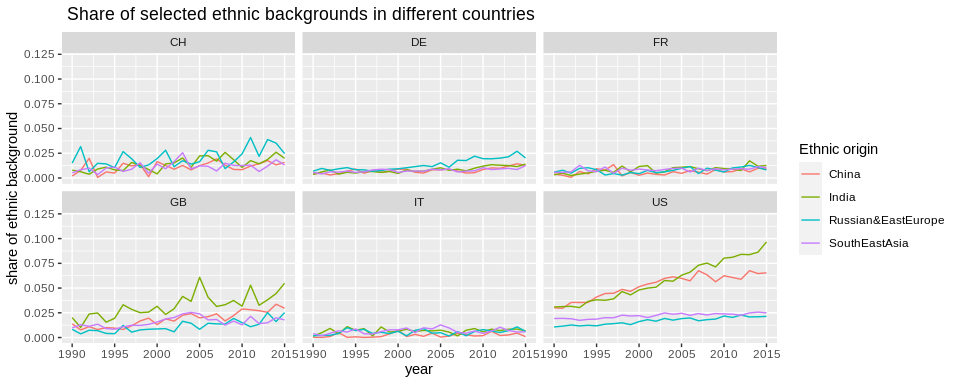
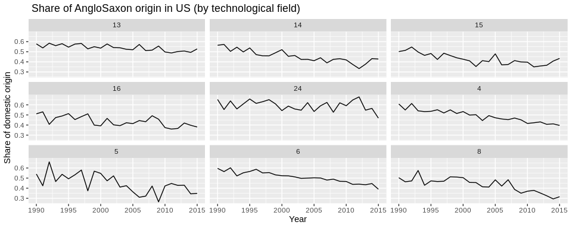

## **Introduction and the General Idea**
There is a growing literature of theoretical and empirical papers (mostly concerning the USA) that focus on the effects of high-skilled migration on innovation. Typically, these studies find substantial benefits from high-skilled migration into the USA [e.g. @AcemogluAkcigit2018; @AkcigitStantcheva2016; @Moser2014; or @DoranIsen2014]. In particular, large inflows of high-skilled workers from China and India since the 1990s seemed to have fostered U.S.-based innovation [for an overview see @Kerr2016; @Peri2016; @Kerr2013]. 

I plan to build on this empirical observations and ***investigate a potential relationship between immigration and onshoring of high-impact R&D***.

The rationale for this is motivated by insights from the trade-in-tasks literature - notably from @BaldwinRobertNicoud2014, @OttavianoPeri2013 and @GrossmanRossiHansberg2008 among others. According to this literature, onshoring of R&D can be interpreted as a form of trade-in-tasks. Furthermore, what this literature suggests is that the Rybczynski theorem from goods-trade also holds in a trade-in-tasks framework [@BaldwinRobertNicoud2014]. That is to say, inflows of foreign inventors should allow the receiving country to specialize in activities that employ these inventors intensively. In other words, given an inflow of 'foreign talent', the U.S. should become relatively more attractive for high-impact R&D activities.

There are several case studies and anecdotal evidence that support this hypothesis (e.g. European tech firms relocate some of their R&D to the U.S.). However, I could not find any large-scale empirical analysis that addresses this question in detail. The reason for this might be, because it is difficult to identify migrants among patent inventors and it is challenging to identify high-impact innovations.

**This is where I plan to make a contribution with my paper**. Specifically, I

1. design and train deep learning algorithms that classify inventors' ethnic background based on their names. 
2. use big data on patents to identify high-impact innovations and onshored R&D. 
3. can then combine these aspects to make descriptive and/or analytic investigations about the interplay between (long-term) migration and onshoring of high-impact R&D.

In what follows, I discuss and describe my approach in more detail and I present some results from exploratory data analysis. 

## **Migration and the Ethnic Composition of Patent Inventors**
Oftentimes, previous studies have focused on non-US citizens among patent inventors [@Kerr2013]. While such an approach makes a lot of sense for some specific questions (e.g. the effect of migration restrictions on innovation), it also has several shortcomings: First, the nationality of patent inventors is only observed for a sub-sample of U.S. patents and not for any other patents e.g. European patents [@MiguelezFink2013]. Second, immigrants can obtain citizenship and thus, the the share of immigrant inventors gets underestimated in the longer run [@BreschiLissoni2019]. Using the names of inventors as a proxy for ethnic background offers a remedy for these two problems. However, it introduces a new bias, which is that e.g. 2nd generation immigrants will also be considered as immigrants even though they have potentially been born in and obtained the citizenship of the immigrant country.

Therefore, by using names I obtain a measure for *ethnic background* and not directly for migrant status. This is fine for the purpose of my analysis, which is to focus on longer-run migration effects. In this regard, the previous literature has mainly used simple name-matching for some selected origins [e.g. @Kerr2013] or relied on (somewhat non-transparent) commercial tools to infer ethnic backgrounds from names [@BreschiLissoni2019]. 

### **Inferring the Ethnic Origin of Inventors with Deep Learning**
For my analysis, I desgin and train a special kind of neural network which is capable to process names. To do this, I have to encode names as sequences of data. In other words, I transform a name to a sparse matrix of zeros and ones. Rows indicate the first, second... last character of a specific name and the columns specify letters of the Latin alphabet. If the first row features a "1" in the first column and zeros in all others, this means that the first character of this name is an "A". An example for a fully encoded name is given below:


```
##       [,1] [,2] [,3] [,4] [,5] [,6] [,7] [,8] [,9] [,10] [,11] [,12] [,13]
##  [1,]    0    0    0    0    0    0    0    0    0     0     0     0     0
##  [2,]    0    0    0    0    0    0    0    0    0     0     0     0     0
##  [3,]    0    0    0    0    0    0    0    0    0     0     0     1     0
##  [4,]    0    0    0    0    0    1    0    0    0     0     0     0     0
##  [5,]    0    0    0    0    0    0    0    0    0     0     0     0     0
##  [6,]    0    0    0    0    0    0    0    0    0     0     0     0     0
##  [7,]    0    0    0    0    1    0    0    0    0     0     0     0     0
##  [8,]    0    0    0    1    0    0    0    0    0     0     0     0     0
##  [9,]    0    0    0    0    1    0    0    0    0     0     0     0     0
## [10,]    0    0    0    0    0    0    0    0    0     0     0     0     0
##       [,14] [,15] [,16] [,17] [,18] [,19] [,20] [,21] [,22] [,23] [,24] [,25]
##  [1,]     0     0     0     0     1     0     0     0     0     0     0     0
##  [2,]     0     1     0     0     0     0     0     0     0     0     0     0
##  [3,]     0     0     0     0     0     0     0     0     0     0     0     0
##  [4,]     0     0     0     0     0     0     0     0     0     0     0     0
##  [5,]     0     0     0     0     0     0     0     0     0     0     0     0
##  [6,]     0     0     0     0     0     0     0     0     0     1     0     0
##  [7,]     0     0     0     0     0     0     0     0     0     0     0     0
##  [8,]     0     0     0     0     0     0     0     0     0     0     0     0
##  [9,]     0     0     0     0     0     0     0     0     0     0     0     0
## [10,]     0     0     0     0     1     0     0     0     0     0     0     0
##       [,26] [,27] [,28]
##  [1,]     0     0     0
##  [2,]     0     0     0
##  [3,]     0     0     0
##  [4,]     0     0     0
##  [5,]     0     1     0
##  [6,]     0     0     0
##  [7,]     0     0     0
##  [8,]     0     0     0
##  [9,]     0     0     0
## [10,]     0     0     0
```

I apply this procedure to over 50'000 names, for which I have also obtained the probability of belonging to one of 15 different ethnic groups from the <a href=https://name-prism.com/about>name-prism</a> database [see @Ye2017]. With this dataset, I can train machine learning and deep learning models that learn to assign ethnic backgrounds to names. 

To start, I have trained a so-called long-short-term-memory (LSTM) model. This is an artificial recurrent neural network that is specifically designed to process sequences of data. In the case of names, this sequence corresponds to the characters of the name (as shown above). The models that I have trained thus far reach a performance that is comparable or better than some of the models that I have found in the literature (e.g. an overall accuracy of 81.9% and a average F1 score of 80.7%) [e.g. @Ye2017]. The architecture of this first model is shown below.


```
## Model
## Model: "sequential_1"
## ________________________________________________________________________________
## Layer (type)                        Output Shape                    Param #     
## ================================================================================
## lstm_6 (LSTM)                       (None, 30, 512)                 1107968     
## ________________________________________________________________________________
## dropout_3 (Dropout)                 (None, 30, 512)                 0           
## ________________________________________________________________________________
## lstm_7 (LSTM)                       (None, 30, 256)                 787456      
## ________________________________________________________________________________
## dropout_4 (Dropout)                 (None, 30, 256)                 0           
## ________________________________________________________________________________
## lstm_8 (LSTM)                       (None, 64)                      82176       
## ________________________________________________________________________________
## dropout_5 (Dropout)                 (None, 64)                      0           
## ________________________________________________________________________________
## dense_1 (Dense)                     (None, 15)                      975         
## ================================================================================
## Total params: 1,978,575
## Trainable params: 1,978,575
## Non-trainable params: 0
## ________________________________________________________________________________
```

After training the model, I can then use it to make predictions about the ethnic background of patent inventors. Below, you can see what the output of this deep learning model is. For every name, it predicts the probability of belonging to each of the 14 different ethnic origin groups.


```
##            AngloSaxon China French German HispanicLatinAmerica India Italian
## rolf weder       0.10     0      0   0.87                 0.00  0.00    0.00
## aya kachi        0.02     0      0   0.00                 0.13  0.04    0.04
##            Japan Korea MiddleEast Persian Russian&EastEurope Scandinavian
## rolf weder  0.00     0          0    0.00               0.00         0.01
## aya kachi   0.46     0          0    0.03               0.01         0.00
##            SouthEastAsia Turkey
## rolf weder          0.00   0.00
## aya kachi           0.23   0.04
```

There are two possibilities to use this information for my analysis. I could either classify every name to only one ethnic background (e.g. to the one with the highest probability or according to some threshold-probability) or I could also directly use the individual class probabilities.

I decided to use the latter approach. The reason is that some names can have rather high probabilities for several ethnic groups. Two examples are given below. "Michael Muller" could be an American but also a German name. Similarly, "Stefanie Berger" could be of French or German origin. Classifying to the highest probability would not account for that.


```
##                 AngloSaxon China French German HispanicLatinAmerica India
## michael muller        0.67     0   0.01   0.31                 0.00     0
## stefanie berger       0.05     0   0.35   0.57                 0.01     0
##                 Italian Japan Korea MiddleEast Persian Russian&EastEurope
## michael muller     0.00     0     0          0       0                  0
## stefanie berger    0.01     0     0          0       0                  0
##                 Scandinavian SouthEastAsia Turkey
## michael muller             0             0      0
## stefanie berger            0             0      0
```

Therefore, I decided to use the ethnic origin probabilities for my analysis. I proceed in the following way: For a given year and country (or region, or technological field), I sum up the probabilities to belong to ethnic class $j$ for all inventors and divide it by the total number of inventors $N$ in this country and year. All the $J$ different ethnic origin shares sum up to unity.

$$EthnicShare_j = \frac{\sum_{i = 1}^{N} P_{i,j}}{N}$$

With this approach, I obtain a measure for the ethnic composition of inventors in a given country, region or technological field for a given point in time. Below, I highlight this for the case with the four previously presented example names: A patent universe that would only consist of these four inventor names would have the following ethnic origin composition:


```
##           AngloSaxon                China               French 
##               0.2100               0.0000               0.0900 
##               German HispanicLatinAmerica                India 
##               0.4375               0.0350               0.0100 
##              Italian                Japan                Korea 
##               0.0125               0.1150               0.0000 
##           MiddleEast              Persian   Russian&EastEurope 
##               0.0000               0.0075               0.0025 
##         Scandinavian        SouthEastAsia               Turkey 
##               0.0025               0.0575               0.0100
```

In the next section, I present preliminary results when I apply the outlined procedure to a representative sub-sample of 500'000 patents inventors (the full sample will consider more than 4 million inventors).

### **Preliminary Results**
First, I want to show some results concerning the dominant domestic origin share of patent inventors located in different countries. The graph below highlights this for the US (AngloSaxon), China (Chinese), Japan (Japanese), Korea (Korean), Great Britain (AngloSaxon), France (French), Germany (German) and Italy (Italian). Switzerland is not included because it is a multilingual country. The sample data is from 1990 to 2015 (the full dataset will cover years starting in 1978).


In the U.S. the share of Anglo-Saxon origin has steadily declines. Similarly, this is also the case for Germany and Great Britain (to a lesser extent also for France). Still, it is remarkable that the level of this domestic origin share is - and remains - much lower in the U.S. compared to other industrialized economies. Notably, in 2015 Anglo-Saxon origin corresponds to less than 50% of the ethnic composition in the U.S. (compared to around 65% for German origin in Germany). Therefore, the U.S. seemed to have retained it's privileged position in terms of inventor diversity over the last 25 years.

However, the decline of the dominant ethnic origin among patent inventors can suggest several things: First, these countries could have become more attractive for foreign talents, making their ethnic composition more diverse. Second, their education systems could have been very effective in integrating descendants of earlier immigrants to become inventors (e.g. Children of Turkish immigrants in Germany or children of Latin American immigrants in the U.S.). Third, it could also simply mean that the pattern of name-giving has changed, e.g. Germans could have become more likely to give their children no typical German names anymore (e.g. more 'Lauras' instead of 'Gudruns'). The last point should be considered by the classification model to some extent, as this would have been taken into account when I trained it. However, it cannot be completely ruled out.

Another interesting thing is thus, which ethnic origins have changed over time in different countries. From the literature, it is known that the U.S. has especially attracted high-skilled immigrants from China and India. I should also observe this as an increase in these origin shares for the U.S. I investigate this in the plot below and extend the analysis to European countries as well as to origin shares of "Russia&EastEurope" and "SouthEastAsia" (i.e. Thailand, Vietnam, Malaysia, Indonesia).


This presents some interesting results. I do also observe a strong increase for Chinese and Indian origin shares in the U.S. (to a lesser extent also in Great Britain), but not for European countries. That is to say, inventors from these regions seem to have almost exclusively migrated to Anglo-Saxon countries. Thus, primarily the U.S. seems to be very attractive for foreign non-Western inventors. 

In the next step, I want to stress in which technological fields this inflow of foreign inventors occured. For this purpose, I plot the share of Anglo-Saxon origin among patent inventors in selected technological fields for the U.S.


The technological fields that are considered here are the following: 13. Medical technology, 14. Organic fine chemistry, 15. Biotechnology, 16. Pharmaceuticals, 24. Environmental technology, 4. Digital communication, 5. Basic communication processes, 6. Computer technology, 8. Semiconductors. 

The strongest decline of Anglo-Saxon origin shares seems to be in the "new" fields related to Digitization and Semiconductors. In all of these fields, the Anglo-Saxon origin share is much below 50%, sometimes only 30%. I have also conducted the same analysis for Germany or Great Britain and also found a decline of the domestic origin share. Note, however, that due to the relatively "small" sample, these preliminary results for Germany and Great Britain are not really robust. In any case, the level of the domestic origin share is much higher and I expect this to hold for the full sample. This suggests that it might be much easier for the U.S. to attract (much more) foreign talent in key technological fields.

This brings me to the second piece of my analysis: If it is easier for the U.S. to attract high-skilled talents globally, could this push non-U.S. firms to offshore parts of their R&D to the U.S.? How I approach this question empirically is discussed in more detail in the following section.

## **Onshoring of High-Impact R&D**


## **Bringing Everything together: Future Directions of Research**


## **Literature**


